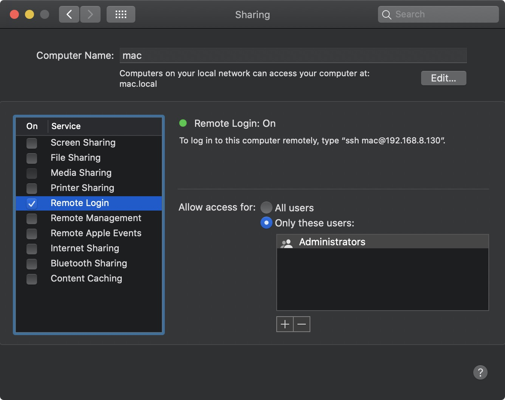
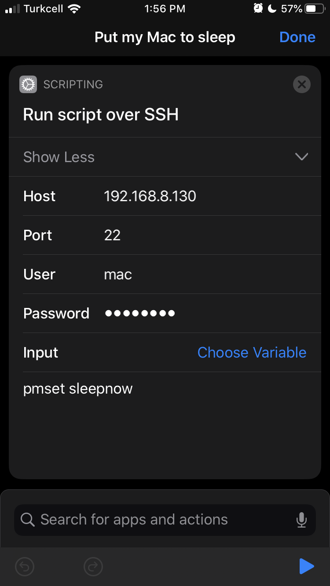

# Put your Mac to sleep with your iPhone

Mac: Go to **System Preferences / Sharing** and make sure **Remote Login** is checked. And keep open this window because we need the IP in the next step.

iPhone: Open [Shortcuts](https://apps.apple.com/us/app/shortcuts/id915249334) app, then go to **New Shortcut / Add Action / Run script over SSH / Show More**.
Type your Mac IP into **Host**, your Mac username into **User**, your Mac password into **Password** and into the **Script** type `pmset sleepnow`.
Tap **Next** and give your new shortcut a name like **Put my Mac to sleep** and now you can add it to your home screen or you can just use Siri like `Hey Siri, run Put my Mac to sleep`.

